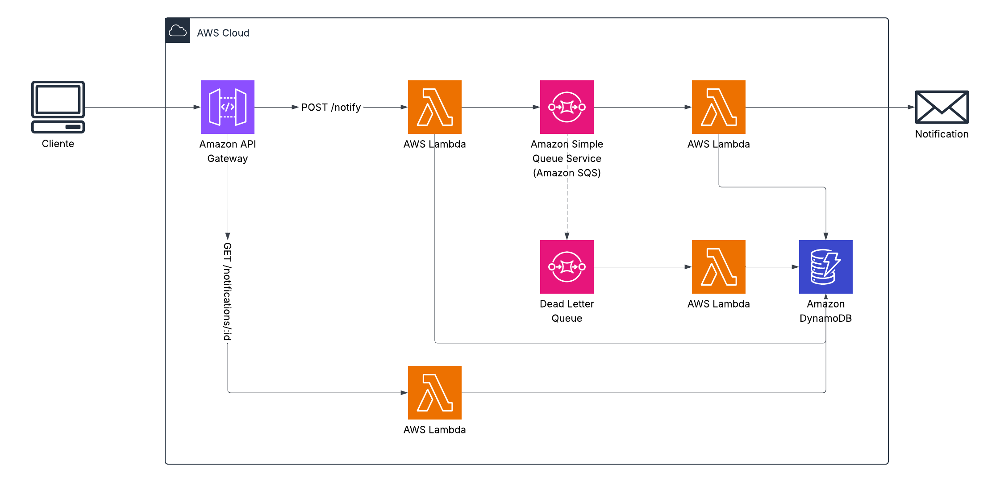

# notifier-hub

Servicio backend centralizado para envío de notificaciones multi-canal (email, SMS, etc).

---

## Índice

- [Arquitectura](#arquitectura)
- [API Reference](#api-reference)
  - [Endpoints](#api-reference)
  - [Códigos de error](#códigos-de-error)
- [Instalación y desarrollo local](#instalación-y-desarrollo-local)
- [CI/CD](#cicd)
  - [Pipelines](#pipelines)
  - [Secretos requeridos](#secretos-requeridos)

---

## Arquitectura



### Flujo de datos

```
Cliente
  │
  ▼
API Gateway (REST v1)  ──►  POST /v1/notify
  │                          GET  /v1/notifications
  │                          GET  /v1/notifications/{id}
  ▼
Lambda enqueue             Lambda query
  │                              ▲
  ▼                              │
SQS main ──► Lambda worker ──► DynamoDB
  │
  ▼ (on failure)
SQS DLQ ──► Lambda dlq
```

### Recursos AWS

| Recurso | Nombre | Descripción |
|---|---|---|
| API Gateway REST | `UE1NOTIFIERGTW001` | Entry point HTTP con API Key + Usage Plan |
| Lambda `enqueue` | `UE1NOTIFIERLMB001` | Recibe solicitudes y las encola en SQS |
| Lambda `query` | `UE1NOTIFIERLMB002` | Consulta el estado de una notificación |
| Lambda `worker` | `UE1NOTIFIERLMB003` | Consume SQS y despacha la notificación |
| Lambda `dlq` | `UE1NOTIFIERLMB004` | Procesa mensajes en la Dead Letter Queue |
| SQS `main` | `UE1NOTIFIERSQS001` | Cola principal de notificaciones |
| SQS `dlq` | `UE1NOTIFIERSQS002` | Cola de mensajes fallidos |
| DynamoDB | `UE1NOTIFIERDDB001` | Registro persistente del estado de cada notificación |
| IAM Role | `UE1NOTIFIERROL001` | Rol de ejecución compartido por todas las Lambdas |

---

## Canales soportados (primera versión)

| Canal | Proveedor | Estado |
|---|---|---|
| Email | AWS SES | ✅ Activo |
| SMS | AWS SNS | ✅ Activo |

---

## API Reference

Todas las rutas requieren el header `x-api-key` con la clave generada en API Gateway.

### POST `/v1/notify`

Encola una nueva notificación.

**Request body:**
```json
{
  "canal": "email",
  "proveedor": "ses",
  "para": "destinatario@ejemplo.com",
  "asunto": "Bienvenido",
  "cuerpo": "Este es el cuerpo del mensaje"
}
```

**Response `202`:**
```json
{
  "data": { "notificationId": "abc123" }
}
```

---

### GET `/v1/notifications/{id}`

Consulta una notificación por ID.

**Response `200`:**
```json
{
  "data": {
    "id": "abc123",
    "canal": "email",
    "status": "SENT",
    "creadoEn": "2026-04-08T12:00:00Z"
  }
}
```

---

### GET `/v1/notifications`

Lista notificaciones filtradas. Parámetros: `?status=PENDING`

---

### Códigos de error

```json
{ "code": "NTF-001", "description": "El campo \"para\" debe ser un correo electrónico válido" }
```

| Código | HTTP | Descripción |
|---|---|---|
| `NTF-001` | 400 | Email inválido |
| `NTF-002` | 400 | Teléfono inválido (E.164) |
| `NTF-003` | 400 | Proveedor no compatible con el canal |
| `NTF-004` | 400 | Asunto requerido para canal email |
| `NTF-005` | 404 | Notificación no encontrada |
| `NTF-006` | 500 | Sin remitente registrado para canal:proveedor |
| `NTF-007` | 500 | Error inesperado |
| `NTF-008` | 500 | Variable de entorno faltante |
| `NTF-009` | 400 | Body de request inválido |
| `NTF-010` | 500 | Error en batch de DLQ |
| `NTF-011` | 500 | Error al enviar por el proveedor externo |

---

## Instalación y desarrollo local

```bash
# Instalar dependencias
npm install

# Tests unitarios
npm test

```
---

## CI/CD

### Pipelines

| Archivo | Trigger | Acción |
|---|---|---|
| `dev.yml` | `push` a `develop` | Deploy en AWS DEV |
| `qa.yml` | `push` a `release` | Deploy en AWS QA |
| `prd.yml` | `push` a `master` | Deploy en AWS PRD |
| `destroy.yml` | Manual (`workflow_dispatch`) | Destruye el stack del stage seleccionado |

### Secretos requeridos

Configurar en GitHub → Settings → Environments:

**`deployer-dev` / `deployer-qa` / `deployer-prd`:**
```
AWS_ACCESS_KEY_ID
AWS_SECRET_ACCESS_KEY
CDK_DEFAULT_ACCOUNT
AWS_DEFAULT_REGION
SES_SOURCE_EMAIL
```
